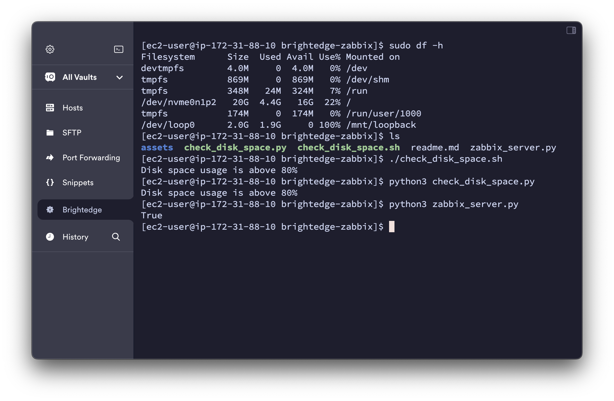
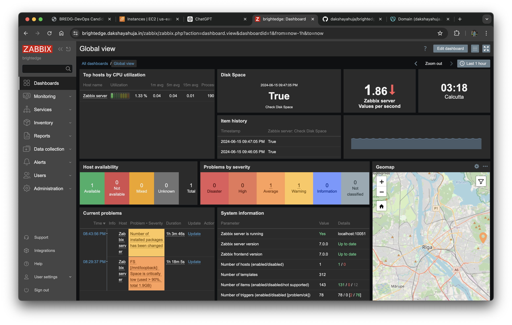
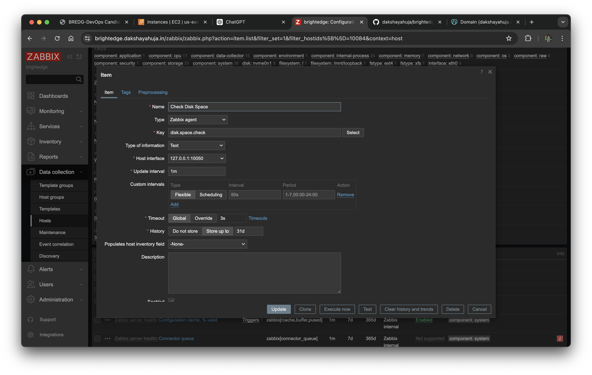
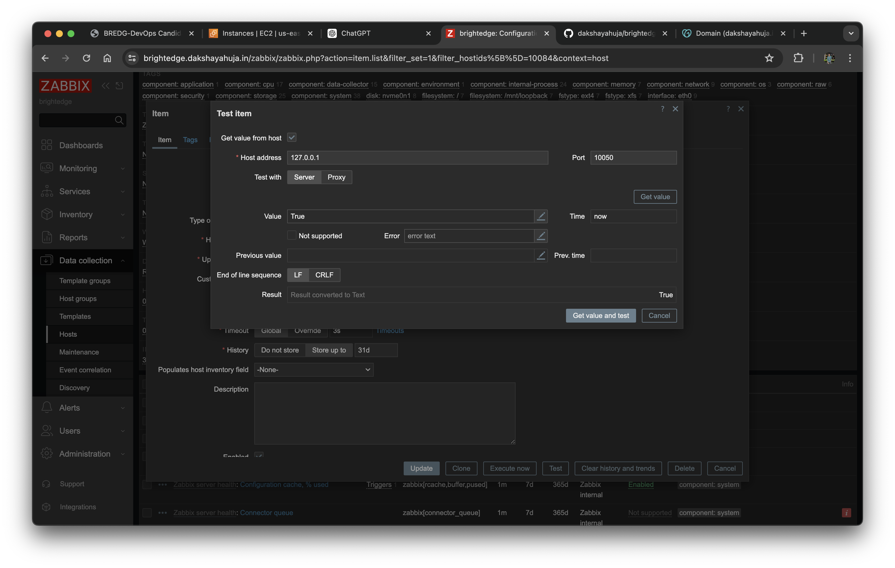

# Zabbix Monitoring Solution Documentation

## Summary

This documentation outlines the steps to set up a Zabbix monitoring solution that checks disk space usage and alerts when any filesystem has less than 20% free space. The solution involves writing Linux and Python scripts, configuring the Zabbix agent and server, and ensuring proper permissions. The Zabbix server has been deployed on an AWS VM using CentOS Stream 9. 

The Zabbix dashboard can be accessed at [https://brightedge.dakshayahuja.in](https://brightedge.dakshayahuja.in) using the credentials:<br> Username - Admin <br> Password - zabbix

The documentation is available at [https://brightedge.dakshayahuja.in/docs](https://brightedge.dakshayahuja.in/docs).

## Steps

### 1. Write a Linux Shell Script

Write a Linux shell script that determines if any of the mounted file systems have less than 20% free disk space.

#### Content of `check_disk_space.sh`:

```sh
#!/bin/bash

# Check all mounted file systems
df -h | awk '{if (NR!=1 && $5+0 > 80) print $0}' > /tmp/disk_usage_report.txt

# If any file system is above 80% usage, alert
if [ -s /tmp/disk_usage_report.txt ]; then
  echo "Disk space usage is above 80%"
  exit 1
else
  echo "Disk space usage is under control"
  exit 0
fi
```

### 2. Write a Python Equivalent Script

Write a Python script that performs the same check.

#### Content of `check_disk_space.py`:

```python
import subprocess

def check_disk_space():
    result = subprocess.run(['df', '-h'], capture_output=True, text=True)
    lines = result.stdout.splitlines()

    for line in lines[1:]:
        parts = line.split()
        usage = int(parts[4].strip('%'))
        if usage > 80:
            print("Disk space usage is above 80%")
            return 1

    print("Disk space usage is under control")
    return 0

if __name__ == "__main__":
    exit(check_disk_space())
```

### 3. Create a Python Script for Zabbix

Create a Python script named `zabbix_server.py` that checks disk space usage and returns "True" if any filesystem has less than 20% free space, otherwise returns "False".

#### Content of `zabbix_server.py`:

```python
#!/usr/bin/env python3
import subprocess

def check_disk_space():
    result = subprocess.run(['df', '-h'], capture_output=True, text=True)
    lines = result.stdout.splitlines()

    for line in lines[1:]:
        parts = line.split()
        usage = int(parts[4].strip('%'))
        if usage > 80:
            return "True"

    return "False"

if __name__ == "__main__":
    print(check_disk_space())
```

### 4. Set Execute Permissions for the Python Script

Ensure the Python script has execute permissions:

```sh
chmod +x /home/ec2-user/zabbix_server.py
chown zabbix:zabbix /home/ec2-user/zabbix_server.py
```

### 5. Configure Sudoers for Zabbix User

Edit the sudoers file to allow the Zabbix user to run the script without a password:

```sh
sudo visudo
```

Add the following line:

```sh
zabbix ALL=(ALL) NOPASSWD: /usr/bin/env python3 /home/ec2-user/zabbix_server.py
```

### 6. Update Zabbix Agent Configuration

Edit the Zabbix agent configuration file:

```sh
sudo vim /etc/zabbix/zabbix_agentd.conf
```

Add or update the following line:

```ini
UserParameter=disk.space.check,sudo /usr/bin/env python3 /home/ec2-user/zabbix_server.py
```

### 7. Restart the Zabbix Agent

Restart the Zabbix agent to apply the changes:

```sh
sudo systemctl restart zabbix-agent
```

### 8. Verify the Configuration

- **Run the script manually** to ensure it returns "True" or "False":

  ```sh
  sudo -u zabbix /usr/bin/env python3 /home/ec2-user/zabbix_server.py
  ```

- In the **Zabbix frontend**, configure an item to use the key `disk.space.check` and set the type to "Text". Verify that it retrieves the correct value from the agent.

### 9. Temporarily Disable SELinux

If you encounter permission issues, temporarily disable SELinux to see if it resolves the problem:

```sh
sudo setenforce 0
```

### 10. Creating a Disk with More Than 80% Space Utilized

To test the script, we created a loopback device with more than 80% disk usage:

1. **Create a Loopback File**:
   
   ```sh
   sudo dd if=/dev/zero of=/home/ec2-user/loopback.img bs=1M count=2048
   ```

2. **Set Up the Loopback Device**:
   
   ```sh
   sudo losetup /dev/loop0 /home/ec2-user/loopback.img
   ```

3. **Create a Filesystem on the Loopback Device**:
   
   ```sh
   sudo mkfs.ext4 /dev/loop0
   ```

4. **Mount the Loopback Device**:
   
   ```sh
   sudo mkdir /mnt/loopback
   sudo mount /dev/loop0 /mnt/loopback
   ```

5. **Fill the Loopback Device**:
   
   ```sh
   sudo dd if=/dev/zero of=/mnt/loopback/largefile bs=1M count=1900
   ```

### Screenshots

1. **Script Execution**:
   

2. **Dashboard Overview**:
   

3. **Zabbix Item Configuration**:
   

4. **Zabbix Test Item**:
   